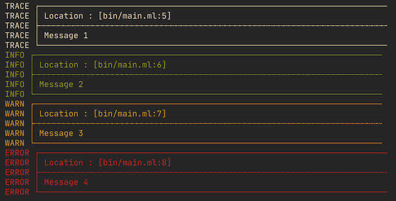

# OcamLog

Logger pour Ocaml.

# Usage


## Simple

Fichier exemple `bin/main.ml`:

```ocaml
open Lib

let () = Ocamlog.print Trace "Message 1"

let () = Ocamlog.print Info "Message 2"

let () = Ocamlog.print Warning "Message 3"

let () = Ocamlog.print Error "Message 4"
```


## Décorations

Fichier exemple `bin/main.ml`:

```ocaml
open Lib
let () = Ocamlog.enableDecorations ()

let () = Ocamlog.print Trace "Message 1"
let () = Ocamlog.print Info "Message 2"
let () = Ocamlog.print Warning "Message 3"
let () = Ocamlog.print Error "Message 4"

let () = Ocamlog.disableDecorations ()
```



# Inspiration

Merci grand maître [Émilien](https://github.com/emilienlemaire) pour cette super idée :
[CppLogger2](https://github.com/emilienlemaire/CppLogger2)

