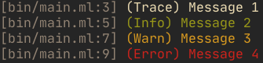

# OcamLog

Logger pour Ocaml.

# Usage

Fichier exemple `bin/main.ml`:

```ocaml=
open Lib

let () = Ocamlog.print Trace "Error"

let () = Ocamlog.print Info "Error"

let () = Ocamlog.print Warning "Error"

let () = Ocamlog.print Error "Error"
```



# Inspiration

Merci grand maître Émilien pour cette super idée :
[https://github.com/emilienlemaire/CppLogger2](CppLogger2).

